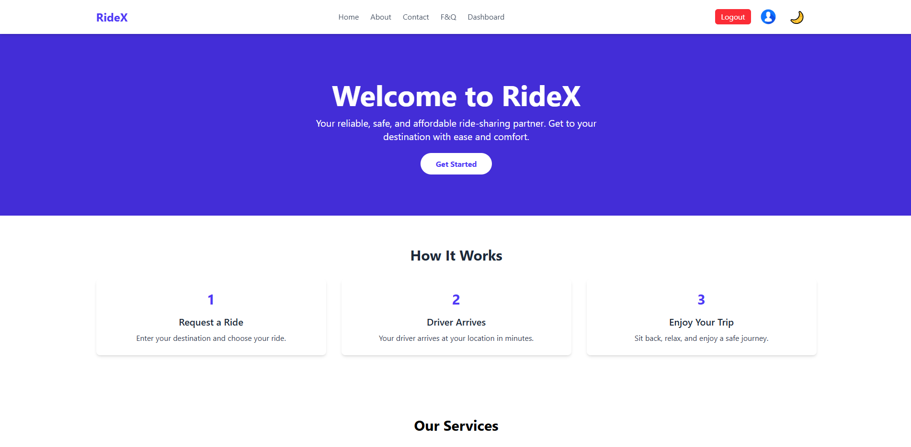

# RideX - A Modern Ride-Sharing Frontend Platform

<div align="center">
  
</div>


This repository contains the frontend for **RideX**, a production-grade, fully responsive, and role-based ride booking application, similar to Uber or Pathao. It is built with React, Redux Toolkit (featuring RTK Query for API interactions), and styled with Tailwind CSS.

---

## 🚀 Live Links & Demo

-   **Live Frontend URL:** [https://ride-x-puce.vercel.app/](https://ride-x-puce.vercel.app/)
-   **Live Backend URL:** [https://ridex-server-seven.vercel.app/](https://ridex-server-seven.vercel.app/)
-   **Backend Repositorie URL:** [https://github.com/maksudulhaque2000/RideX-Server](https://github.com/maksudulhaque2000/RideX-Server)
-   ## 🎬 [Video Explanation Link](https://drive.google.com/file/d/1fwL1vwCjXs27QY8oTPCHHUdOKf4IPShe/view?usp=sharing)

---

## ✨ Key Features

This application provides a comprehensive set of features tailored for three distinct user roles: **Rider**, **Driver**, and **Admin**.

### 📚 (General Features)
-   **Fully Responsive Design:** A polished and intuitive UI/UX across mobile, tablet, and desktop devices.
-   [cite_start]**Role-Based Navigation:** Menus and dashboards adapt based on the logged-in user's role.
-   [cite_start]**Persistent Authentication:** User login state is preserved across browser sessions.
-   **Dark/Light Mode:** A theme toggle for user comfort.
-   [cite_start]**Robust Form Validation:** All forms include strict validation with user-friendly error messages.
-   [cite_start]**Toast Notifications:** Real-time feedback for both successful and failed actions using `react-hot-toast`.
-   [cite_start]**Skeleton Loaders:** Enhanced perceived performance with skeleton loaders during data fetching.
-   **Guided Tour:** An interactive guided tour for new admins to explore the dashboard features.

### 🌐 Public Pages
-   [cite_start]**Multi-Section Homepage:** A feature-rich landing page with a Hero Section, How It Works, Services, Testimonials, and a Call-to-Action.
-   [cite_start]**About, Contact, and FAQ Pages:** Static pages with a searchable FAQ section.

### 👤 Rider Features
-   **Ride Request Form:** A simple form to request a ride by providing pickup/destination coordinates and an offered fare.
-   **Active Ride View:** A dedicated page to view the status and details of an ongoing ride.
-   [cite_start]**SOS Button:** An emergency SOS button on the active ride screen to simulate sharing the user's current location.
-   **Ride History:** A paginated and filterable list of all past rides, including details like fare and status.
-   **Profile Management:** Riders can view and update their personal information.

### 🚗 Driver Features
-   [cite_start]**Online/Offline Toggle:** A persistent toggle in the dashboard sidebar for drivers to manage their availability.
-   [cite_start]**Incoming Ride Requests:** A real-time view of pending ride requests with the option to **Accept** or **Reject** them.
-   [cite_start]**Active Ride Management:** A dedicated page to manage the status of an accepted ride (e.g., Picked Up, In Transit, Completed).
-   [cite_start]**Earnings Dashboard:** A visual breakdown of total earnings and completed rides, featuring charts for monthly performance.
-   **Ride History:** A paginated and filterable list of all completed or cancelled rides.

### 👮 Admin Features
-   [cite_start]**Comprehensive User Management:** A powerful interface to view, search, and filter all users (Riders, Drivers, Admins).
-   **User Actions:** Admins can **Block/Unblock** any user and **Make Admin/Remove Admin** privileges.
-   **Driver Approvals:** A dedicated page to manage new driver applications, with options to **Approve** or **Suspend** them.
-   **Ride Oversight:** A complete overview of all rides in the system, with advanced filtering by status.
-   [cite_start]**Analytics Dashboard:** Data visualizations showing key platform metrics like total users, rides, revenue, and a guided tour for new admins.

---

## 🏗️ Architecture & Key Decisions

-   **State Management:** **Redux Toolkit** with **RTK Query** was chosen for centralized state management and efficient API data caching. This simplifies API calls, handles loading/error states automatically, and provides features like `providesTags` and `invalidatesTags` for seamless data re-fetching after mutations.
-   **Project Structure:** The project follows a feature-sliced architecture. Code is organized by features (e.g., `auth`, `admin`, `ride`) inside the `src/redux/features` directory, and by type (e.g., `pages`, `components`, `layouts`) for UI, promoting scalability and maintainability.
-   **Styling:** **Tailwind CSS (v4)** with its Vite plugin provides a utility-first approach for rapid and consistent UI development. Dark mode is implemented using Tailwind's `dark` variant strategy.
-   **Persistent Login:** A `PersistLogin` component leverages `localStorage` to retrieve the user's token on page load. It then triggers an API call to `/auth/me` to verify the token and fetch the latest user data, ensuring the session is both persistent and secure.

---

## 🛠️ Technology Stack

-   **Framework:** React 19 (with Vite)
-   **Language:** TypeScript
-   **State Management:** Redux Toolkit & RTK Query
-   **Routing:** React Router DOM v7
-   **Styling:** Tailwind CSS v4
-   **UI Enhancements:**
    -   `react-hook-form` for form management
    -   `react-hot-toast` for notifications
    -   `sweetalert2` for confirmation dialogs
    -   `recharts` for data visualization
    -   `@reactour/tour` for the guided tour

---

## ⚙️ Getting Started

To run this project locally, follow these steps:

### 1. Clone the Repository
```bash
git clone [https://github.com/maksudulhaque2000/Assignment-6-L2](https://github.com/maksudulhaque2000/Assignment-6-L2)
cd ride-booking-frontend
```

### 2. Install Dependencies
```bash
npm install
```

### 3. Set Up Environment Variables
Create a `.env` file in the root of the project and add your backend API's base URL.

**`.env`**
```
VITE_API_BASE_URL=http://localhost:5000/api
```
*(For production, replace the URL with your deployed backend link.)*

### 4. Run the Development Server
```bash
npm run dev
```
The application will be available at `http://localhost:5173`.

---

## 🔑 Test Credentials

To test the application with different roles, please use the following credentials on the live site:

-   **Admin Account:**
    -   **Email:** `admin@gmail.com`
    -   **Password:** `password123`

-   **Driver Account:**
    -   **Email:** `driver@gmail.com`
    -   **Password:** `password123`

-   **Rider Account:**
    -   **Email:** `rider@gmail.com`
    -   **Password:** `password123`

---

## 📜 License

This project is licensed under the MIT License. See the [Maksudul-Haque](Maksudul-Haque) file for more details.